# Kernel Secrity Config Evaluation

This report details our preliminary results from evaluating a selected set of Kernel
Hardening configurations across a number of benchmarks.

## Kernel Configurations Tested

**Initial configuration** - We begin with a baseline configuration, generated with `make defconfig` and `make localmodconfig` on a template guest virtual machine, after which we use `make menuconfig` to eliminate unnecessary configurations (as well as any of the security configurations enabled by default). This reduces compiletime significantly, speeding up the first round of testing. 

The initial set of configurations and kernel parameters we evaluate can be found in `KernelSecurityBenchmark/kernsecbench/test_configs.py`. Adding entries to the `kconfig_map` shown below automatically incorperates them into the benchmarking and analysis runs:

```Python
BASE_MIT_OPTIONS = "nospectre_bhb nospectre_v1 spectre_v2=off spectre_v2_user=off retbleed=off pti=off spec_rstack_overflow=off"

# Map from test configuration name to a tuple of kernel configurations and boot parameters
kconfig_map = {
    # Disable all mitigations (see the effect of 'all other' mitigations)
    "all_mit_off": ("", "mitigations=off"),
    
    # Baseline config, disable mitigations we test for 
    "basline": ("", BASE_MIT_OPTIONS),

    # Various spectre_v2 mitigations
    "retpoline_generic": ("CONFIG_RETPOLINE=y",                         "nospectre_v1 spectre_v2=retpoline,generic spectre_v2_user=off retbleed=off pti=off spec_rstack_overflow=off"),
    "ibrs": ("CONFIG_CPU_IBRS_ENTRY=y",                                 "nospectre_v1 spectre_v2=ibrs spectre_v2_user=off retbleed=off pti=off spec_rstack_overflow=off"),
    "eibrs": ("CONFIG_CPU_IBRS_ENTRY=y",                                "nospectre_v1 spectre_v2=eibrs, spectre_v2_user=off retbleed=off pti=off spec_rstack_overflow=off"),
    "all_spectre_v2": ("CONFIG_RETPOLINE=y\nCONFIG_CPU_IBRS_ENTRY=y",   "nospectre_v1 spectre_v2=ibrs,eibrs,retpoline,generic spectre_v2_user=off retbleed=off pti=off spec_rstack_overflow=off"),
    "on_spectre_v2": ("CONFIG_RETPOLINE=y\nCONFIG_CPU_IBRS_ENTRY=y",    "nospectre_v1 spectre_v2=on spectre_v2_user=on retbleed=off pti=off spec_rstack_overflow=off"),

    "pti_on": ("CONFIG_PAGE_TABLE_ISOLATION=y",                         "nospectre_v1 spectre_v2=off spectre_v2_user=off retbleed=off pti=on spec_rstack_overflow=off"),


    "ibpb_on": ("CONFIG_CPU_IBPB_ENTRY=y",                              "nospectre_v1 spectre_v2=off spectre_v2_user=off retbleed=ibpb pti=off spec_rstack_overflow=ibpb"),
    
    "page_poisoning": ("CONFIG_PAGE_POISONING=y", BASE_MIT_OPTIONS + " page_poison=1"),
    "init_on_free_alloc": ("CONFIG_INIT_ON_FREE_DEFAULT_ON=y\nCONFIG_INIT_ON_ALLOC_DEFAULT_ON=y", BASE_MIT_OPTIONS + " init_on_free=1 init_on_alloc=1"),
    "memory_leak_detector": ("CONFIG_DEBUG_KMEMLEAK=y", BASE_MIT_OPTIONS),
    "kernel_address_sanitizer": ("CONFIG_KASAN=y", BASE_MIT_OPTIONS),
    "hardened_usercopy": ("CONFIG_HARDENED_USERCOPY=y", BASE_MIT_OPTIONS),
    "randstruct_full": ("CONFIG_RANDSTRUCT_FULL=y", BASE_MIT_OPTIONS),
    "debug_pagealloc": ("CONFIG_DEBUG_PAGEALLOC=y\nCONFIG_DEBUG_PAGEALLOC_ENABLE_DEFAULT=y", BASE_MIT_OPTIONS),
}
```

Below we briefly describe each of the inital test configurations:

- **baseline** - The baseline configuration includes a 'minimized' default configuratiion, which disables each of the kernel
parameters later described. It also disables each of the mitigation kernel parameters later examined, leaving those not
examined individually in their default state.  

- **all_mit_off** - This configuration is identical to the 'baseline' configuration, but simply uses the `mitigations=off`
kernel parameter to disable *all* speculative-execution permissions. Since there are a number of options we don't examine
individually in this run (e.g. `l1tf1` mitigations), this test configuration allows us to see the performance effect of 
'all the rest' of the speculative execution mitigations on our test platform. 

**generic retpoline** - The first of a number of spectre_v2 mitigations we evaluate is the 'generic retpoline', which
includes `CONFIG_RETPOLINE` and `spectre_v2=retpoline,generic`. This enables a software-only mitigation to spectre_v2
which isolate indirect branches from speculative execution (effectively trapping speculative execution to prevent it from
following indirect branches and leaking secrets). Wherever enabled, this could have significant overhead because the
compiler is effectively inserting 'junk' stubs that get in the way of normal optimizations.

**IBRS** - Enables Indirect Branch Restricted Speculation (IBRS), if supported in hardware. This is a processor feature
that restricts speculative execution of indirect branches on sensitive transitions (for example, system calls). IBRS
allows enabling a mode where previous branch history is not trusted. While this has lower overhead than compiler-inserted junk (generic retpoline), it does effectively flush some processor state on each transition which could introduce overhead for operations that frequently move from userspace to kernelspace.

**eIBRS** - Enables enhanced IBRS, if supported in hardware. This is a processor feature that is the successor to IBRS, presented
by Intel to simplify the IBRS model and reduce performance overhead. Like IBRS, it prevents low-privilege speculation from affecting
high-privilege code, but does so by 'baking in' the concept of predictor mode privilege rather than requiring explicit flushes on tranition from low to high privilege. The hardware itself provides guarantees that low-privlige speculation will be isolated from high-privilege, 
hopefully mitigating the overhead of frequent userspace to kernelspace transitions.

**all_ and on_spectre_v2** - These configurations test the automatically chosen mitigations by the kernel, which likely results in
the kernel selecting eIBRS out of the avaiable mitigations, since it is supported on the platform CPU. The `on` configuration 
additionally enables automatically-selected userspace spectre_v2 mitigations. 

**PTI** - Enables kernel 'page table isolation', which splits the kernelspace and userspace page tables. In usermode, the page table 
is stripped down to eliminate all but a minimal stub of kernel code for making transitions like system calls. This both
mitigates the meltdown vulnerability (though our test platform is not vulnerable to meltdown anyways) as well as generally 
reduces the speculative-execution attack surface, since it makes userspace speculation into kernel addresses impossible. The 
performance impact comes from the increased TLB invalidations/flushes from switching page tables (though modern processors 
tend to mitigate much of the performance impact).

**IBPB** - Indirect Branch Prediction Barrier (IBPB) operates similarly to IBRS, but rather than introducing 'privileged' and
'non-privileged' levels to speculation state, it simply flushes the entire branch prediction state of the processor on transitions
into kernel-mode. This likely introduces high overhead for context switch-heavy operations, since the CPU looses a lot of state
on each transition. However, it significantly reduces the available attack surface for speculative execution into the kernel,
in particular addressing bugs like retbleed and Speculative Return Stack Overflow (SRSO).

**page poison** - Causes the kernel to fill freed pages with a recognizable 'poison' value, and check for that value on
page allocation. If the value no longer fills a page when it is allocated, this indicates there is some memory corruption or
use-after-free bug. This check can help mitigate many kernel heap attacks, especially those based on use-after-free or uninitialized
data reuse. The main overhead likely comes from the frequent required memory write and read operations on page allocation and 
page freeing. 

**init-on-free-default and on-alloc-default** - These configurations automatically initialize memory to zero when it is allocated and
freed, much like page poisoning. However, unlike page poisoning they don't do valiation on the pattern at allocation-time, which likely reduces
the overhead somewhat. As a result, their primary purpose is to prevent leaks and certain use-after-free bugs by wiping various data structures, but will not in general detect memory corruption.

**kmemleak** - Enables the kernel memory leak checker, which is primarly a debugging tool that helps detect memory leaks in the 
kernel allocators. It works by adding tracking to memory allocation and deallocation calls, and periodically 'sweeps' memory to track
down allocations it knows exist, but are not referenced (i.e. have leaked). This is an important check because kernel heap slabs by 
default have no tracking of allocated objects, so without a leak detector have no way of reclaiming leaked objects. The security
benefit of kmemleak is mostly in its ability to catch memory-based logic bugs, which can be used in part of an exploitation. Any added
overhead likely comes from the additional bookkeeping required on each kernel allocation and deallocation event. 

**KASAN** - The Kernel Address SANitizer (KASAN) is a dynamic memory safety checker made for debugging memory bugs in kernelspace. KASAN
effectively constructs a shadow representation of memory, and tracks each allocation and deallocation. On each memory access, compiler-inserted
instrumentation validates that the attempted access falls in a valid (allocated) range. While this can capture a massive array of memory bugs and
is thus much more powerful than kmemleak, instrumenting every memory access (and the cache effects from maintaining shadow memory) is extremely costly and so KASAN is primarily useful as a debugging tool.

**hardened usercopy** - This option adds bounds-checking to memory copy operations between kernel and user space (the `copy_to_user`/`copy_from_user` functions). It ensures the source and destination pointers are valid and within expected object boundaries, preventing overflow or info leak via usercopy. While this can prevent some important bugs, it likely won't have a high performance impact in most scenarios since explicit userspace-kernelspace copying is a small portion of overall memory copies.

**debug pagealloc** - This configuration modifies each physical page free, and every time the kernel frees a physical page it immediately unmaps that page. When the page is needed again, the kernel will map it back. This catches a variety of memory corruption bugs and exploits, which will trigger faults when trying to access memory that has been freed and subsequently unmapped. The main overhead likely comes from TLB effects of frequent page unmapping and remapping. 

There are a number of further configurations we could explore, particularly on a wider variety of hardware. We could look at other speculative
execution vulnerabilities or hardware-specific acceleration (e.g. KASAN acceleration on Arm with memory-tagging). Particularly interesting 
would be exploring how multiple security configurations interact; we could try to understand which mitigation overheads stack or if there are 
certain combinations that cause severe performance degradation beyond each individual mitigation overhead. 

## Benchmarks 

### New Benchmarks
To allow easy use of as many benchmamrks as possible, we integrate with the [Phoronix Test Suite](https://github.com/phoronix-test-suite) and [OpenBenchmarking.org](https://openbenchmarking.org/). Saved in the `KernelSecurityBenchmark/kernsecbench/benchmars` folder, we include a few
sample launch scripts which pull and run open benchmark suites, and dump results to an auxiliary logfile which our analysis code parses. Using this integration with existing benchmarks increases flexibility and reliability of our results. 

Adding a new benchmarking suite is as simple as creating a new `launch_<new-suite>.sh` script and adding the follwing lines:
```bash
AUX_LOG_PATH="/dev/virtio-ports/host-port"

echo "[TAG: RUNNING <NEW-SUITE>]"
phoronix-test-suite batch-run <NEW-SUITE> >> $AUX_LOG_PATH 2>&1
echo "[TAG: <NEW-SUITE> COMPLETE]"
```
### Initial Benchmarks
The key limitation of this project was simply runtime. While we support almost any of the Linux-based benchmarks available on 
[OpenBenchmarking.org](https://openbenchmarking.org/), many are large and take minutes to hours per run. Since our test platform
is in the cloud and our available time and cloud credits were limited, we were not able to test as wide a variety of (particularly real-world)
benchmarks as we would have liked. Instead, we focused on the following representative benchmarks.

#### Microbenchmarks
Each of the following syscall/library call microbenchmarks runs repeatedly with many warmup iterations, followed by a specified number of test iterations, and returns an average. We repeat each overall test (represented by an individual boot via Microwave) 5 times. While we initially 
attempted to use the much more modern and comprehensive `stress-ng` suite from [OpenBenchmarking.org](https://openbenchmarking.org/), 5 repeated runs of those benchmarks across each of our test configurations was prohibitively expensive. Instead, we use modified microbenchmarks from the `lmbench` suite:

**Fork** - Benchmarks the `fork` library call, when followed by calls to `execve`, `exit`, and `execve` into a `/bin/sh` shell. 

**Fstat** - Benchmarks the time to `fstat` an open file with an already-cached inode.

**Open/Close** - Benchmarks the time to `open` and then `close` a file

**Read** - Benchmarks the time it takes to read one byte from `/dev/zero`.

**Write** - Benchmarks the time it takes to write one byte to `/dev/null`.

**Stat** - Benchmarks the time to `stat` a file whose inode is already cached.

**Fstat** - Benchmarks the time to `fstat` a file whose inode is already cached.

**Null Syscall** - Benchmarks the time to make the `getppid` syscall, which is effectively only benchmarking the syscall overhead itself. 

**Select** - Benchmarks the time to make a `select` call on 10, 100, 250, and 500 file descriptors.

**Unix Socket** - Benchmarks the time to communicate via two processes with Unix sockets IPC. 

**Pipe** - Benchmarks the time to communicate via two processes with a Unix `pipe`. 


We also ran a suite of [glibc benchmarks](https://openbenchmarking.org/test/pts/glibc-bench), although we found that our test configurations had minimal impact on these CPU-intensive benchmarks.

#### Macrobenchmarks
We focus on two I/O heavy macro-benchmarks, with slightly different behavior. 

**SVG to PNG** - Benchmarks the SVG to PNG conversion operation in Inkscape.

**SQLite** - Benchmarks high-volume SQLite read and write operations.

### Future Benchmarks 
There are a number of benchmarks which would be interesting to explore going forward. Mainly, these would include macro/real-world
benchmark suites from [OpenBenchmarking.org](https://openbenchmarking.org/). For example, the [pts/server](https://openbenchmarking.org/suite/pts/server) benchmark includes a comprehensive variety server-related benchmarks, including web server, database, and cpu-intensive operations. This
suite would give a much more complete picture of how each test config would behave in the real world, rather than on specific microbenchmarks. 

Another interesting suite to explore would be the [pts/kernel](https://openbenchmarking.org/suite/pts/kernel) benchmarking suite which includes both macro-level database, file I/O, and web server benchmarks as well as the much more modern `stress-ng` operating system microbenchmarks. This could provide more insight into microbenchmarks design specifically with recent versions of Linux in mind. 

Both are archievable to run, but based on our estimations would require running continuously for 7-10 days to cover 5 iterations of each of our test configurations.
<!---
Considered:
### Inkscape 
-svg_to_png 
### lmbench
- microbenchmarks
- fork_bin_sh, fork_execve, fork_exit
- fstat, open/close, pipe latency, read, select_500, stat, syscall
### Stress-NG
- microbenchmarks
-  crypto, memory copying, forking, SysV message,
sempahores, socket, context switch, atomic, malloc, MEMFD, MMAP, sendfile, io_uring,futex,pthread,pipe,cloning
- echo "2,3,4,8,9,10,11,12,13,14,15,16,17,19,20,21,22,23,27,28,31,37,39" | phoronix-test-suite batch-run stress-ng
### SQLite
- I/O heavy
echo 3 | phoronix-test-suite batch-run sqlite
### Kernel Schedbench
-  phoronix-test-suite batch-run schbench

### pts/server
- very real world, very long

### Kernel Compilation
--->

## Evaluation Environment
All of our tests were run using nested virtualization on Google Cloud, on `n2-highcpu-16`
instances with Intel Cascade Lake vCPUs. We enable nested virtualization on GCP, and run QEMU
via Microwave with `-cpu host` to pass all CPU flags and context to the guest. 

Guests are a Linux 6.8.0 kernel, compiled into an up-to-date Ubuntu 24 disk image. 

### Host CPU
```bash
$ lscpu
Architecture:             x86_64
  CPU op-mode(s):         32-bit, 64-bit
  Address sizes:          46 bits physical, 48 bits virtual
  Byte Order:             Little Endian
CPU(s):                   16
  On-line CPU(s) list:    0-15
Vendor ID:                GenuineIntel
  Model name:             Intel(R) Xeon(R) CPU @ 2.80GHz
    CPU family:           6
    Model:                85
    Thread(s) per core:   2
    Core(s) per socket:   8
    Socket(s):            1
    Stepping:             7
    BogoMIPS:             5600.54
    Flags:                fpu vme de pse tsc msr pae mce cx8 apic sep mtrr pge mca cmov pat pse36 clflush mmx fxsr sse sse2 ss ht syscall nx pdpe1gb rdtscp lm constant_tsc
                           rep_good nopl xtopology nonstop_tsc cpuid tsc_known_freq pni pclmulqdq vmx ssse3 fma cx16 pcid sse4_1 sse4_2 x2apic movbe popcnt aes xsave avx f
                          16c rdrand hypervisor lahf_lm abm 3dnowprefetch ssbd ibrs ibpb stibp ibrs_enhanced tpr_shadow flexpriority ept vpid ept_ad fsgsbase tsc_adjust bm
                          i1 hle avx2 smep bmi2 erms invpcid rtm avx512f avx512dq rdseed adx smap clflushopt clwb avx512cd avx512bw avx512vl xsaveopt xsavec xgetbv1 xsaves
                           arat vnmi avx512_vnni md_clear arch_capabilities
Virtualization features:  
  Virtualization:         VT-x
  Hypervisor vendor:      KVM
  Virtualization type:    full
Caches (sum of all):      
  L1d:                    256 KiB (8 instances)
  L1i:                    256 KiB (8 instances)
  L2:                     8 MiB (8 instances)
  L3:                     33 MiB (1 instance)
```

## Evaluation Results

In this section we select a few visualizations of the key evaluations that demonstrate the performance characteristics of each configuration we evaluated, first with an overview of the best and worst performers, then grouping our benchmarks by their access type. 

### Overview
The following normalized heatmap provides a resonable overview of the results we found.
<p align="center">
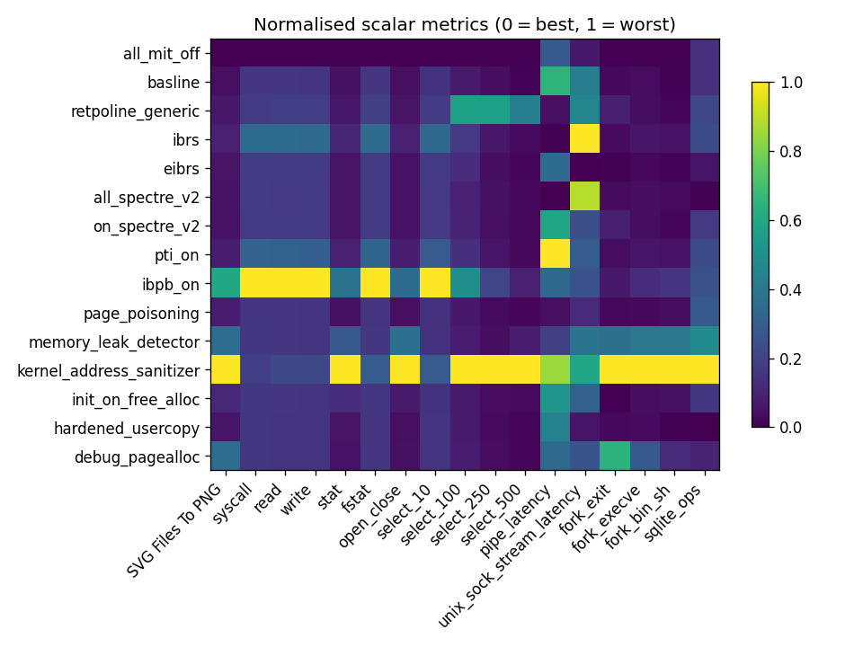
</p>

Unsurprisingly, the two most costly configurations were KASAN and IBPB. KASAN's performance is massively degraded, particularly in more real-world benchmarks where the kernel is performing significant memory operations, because every kernel memory operation is interposed with a sanitization check. Further benchmarks will show the scale of KASAN's performance overhead.

IBPB also shows major performance degradation, although the only benchmarks in which it outstrips KASAN are syscall microbenchmarks. These are understandable because they involve minimal kernel memory access, and instead overhead is dominated by a the full speculative buffer flush required on each context switch with IBPB. 

While the `mitigations=off` configuration is clearly the best performer, as we will see the difference is only meaningful in certain benchmarks.

### Context-Switch Bound

The first group of benchmarks we examine is those which were apparently bound by the overhead of userspace-kernelspace context switching itself. These are distinguished because IBPB and IBRS account for the worst and second worst performers, respectively. Both of these mitigations involve invalidating processor state on a context switch, with IBPB invalidating significantly more. We see that eIBRS is convincingly better performing in these cases that IBRS. These are also some of the benchmarks where the overhead of `PTI=on`, even given newer hardware support and acceleration, is noticable (though not as major as IBPB or IBRS). 
<p align="center">

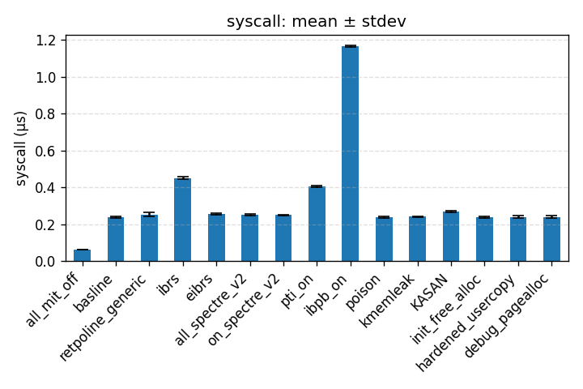
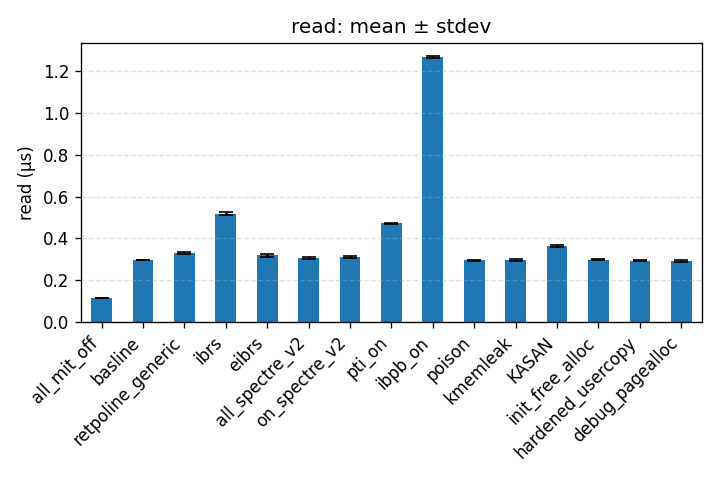

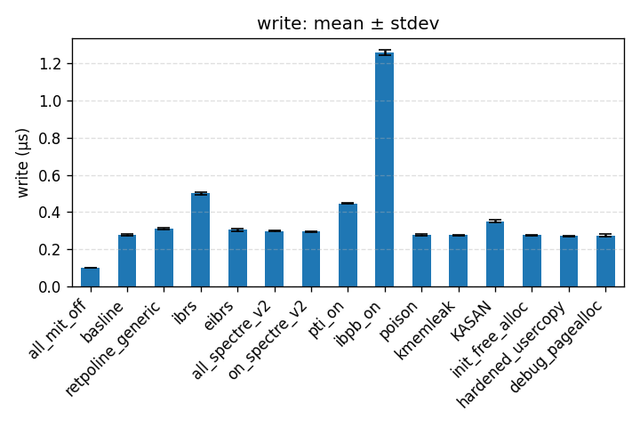

</p>
We can organize the benchmarks in order of the amount of in-kernel work they perform from `syscall` (which represents a pure syscall overhead, as it calls `getppid`) to `fstat` (which collects a significant amount of data from the kernel). In general, the more data collected the more we see KASAN degrades performance, which makes sense considering it adds overhead to every kernel memory access.

Interestingly, these benchmarks are the only in which `mitigations=off` is significantly better than our baseline, which selectively disables those that we test. There are likely one or more further mitgations we don't explore which involve invalidating state at a context-switch boundary, which these microbenchmarks demonstrate. 

### Kernel Memory Bound

The other key group of benchmarks were those that were clearly bound by kernel memory operations, evident by a
major slowdown from KASAN and only minimal impact from IBPB and IBRS. All three `fork` calls fall into this category,
likely because they involve significant in-kernel memory work to set up a new process. 

Even `kmemleak` degrades performance significantly, even though it only introduces small per-allocation bookkeeping rather than per-access validation like `KASAN`. 

<p align="center">
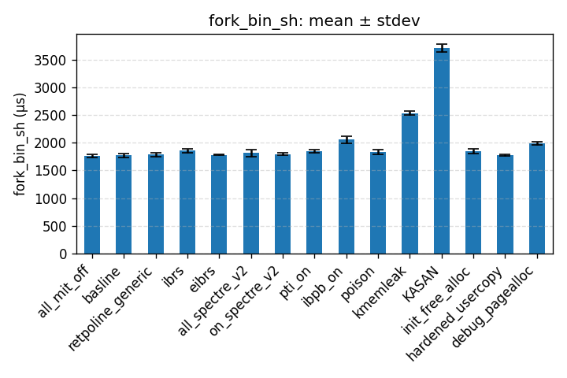
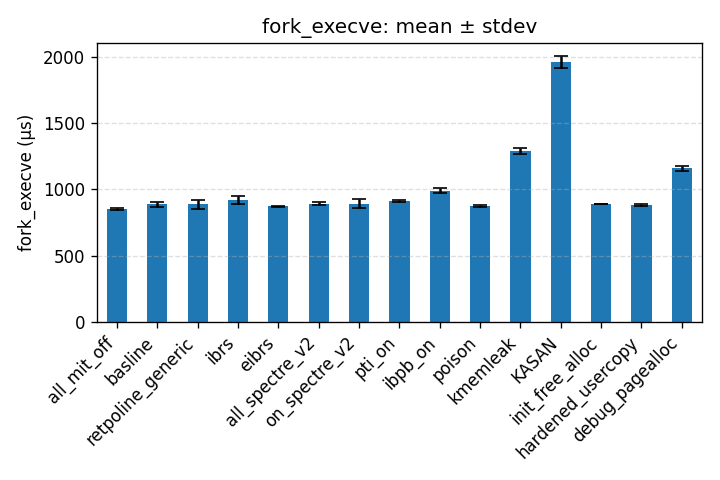
    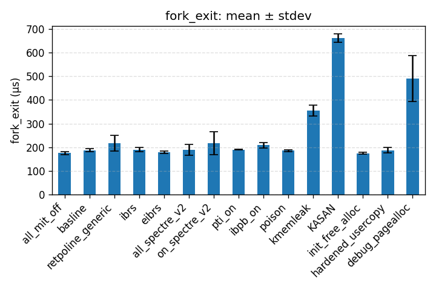
</p>

The `fork` examples, particularly `fork_exit` also demonstrate the scenario where `DEBUG_PAGEALLOC` introduces overhead: when large regions of kernel memory are freed, the overhead introduced by unmapping (and the corresponding TLB and other processor state lost) becomes non-negligible. This is likey the most pronounced for `fork_exit` because unlike the other two, `exit` involves freeing all the memory used by the calling process. 

`fork_exit` is also one of the only tests that includes a noticable degradation because of `retpoline`.

### Both Context-Switch and Kernel Memory Bound

Two benchmarks, `stat` and `open_close` seemed to demonstrate characteristics of both context-switch
and kernel memory operation bound benchmarks. They were significantly impacted by both KASAN/Kmemleak and
IBPB/IBRS, ind
<p align="center">
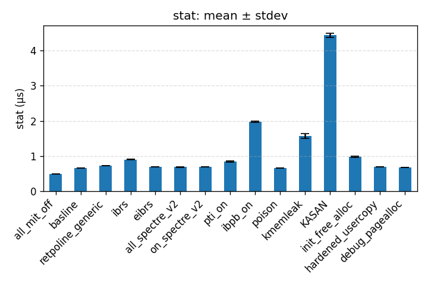
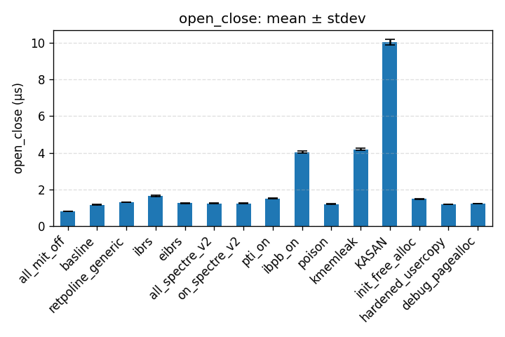
</p>

A surprising feature of these tests is that they seemed to be the only which were impacted by `init_free_alloc` and `poison`, which may mean they involve a higher ratio of kernel memory allocation/free to other work compared to other
benchmarks.

### Select for N=10,100,250,500 

Benchmarks of `select` over a range of file descriptors, from `N=10` up to `N=500` show its transition from
a context switch bound benchmark to a kernel memory *access* bound benchmark. 

<p align="center">
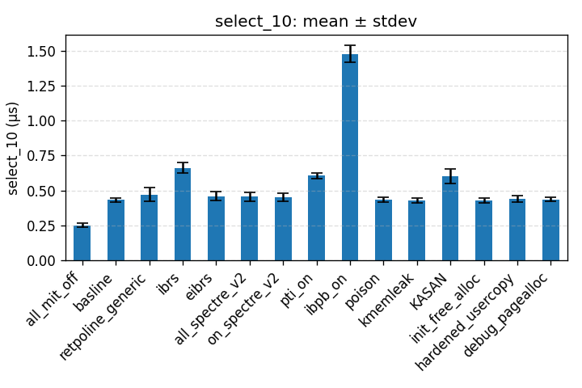
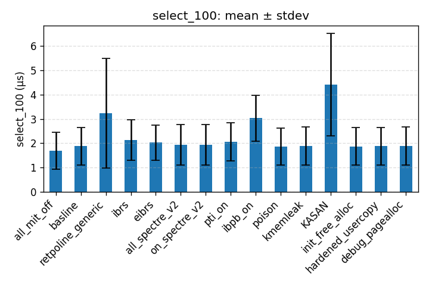
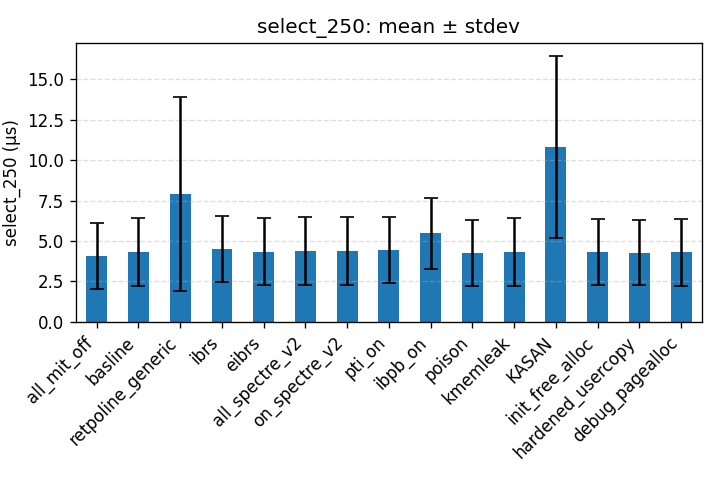

</p>

For `N=10`, the `select` benchmark looks similar to the `getppid`/`null syscall` benchmark, primarily affected by IBPB and IBRS. However, as `N` increases, the effect of these two disappear as the effects of `KASAN` and `retpoline` become dominant (though not, importantly, `kmemleak`). For `N=500`, the only two configurations that significantly affect runtime seem to be `retpoline` and `KASAN`.

Unlike `fork` benchmarks, `select` does not seem as affected by `kememleak`, which indicates that it is bound
specifically by memory *accesses* rather than by memory allocations and deallocations. This is because while `KASAN`
is invoked for every memory access, `kmemleak` only scans memory very rarely (roughly every 10 minutes) and otherwise
only interposes on allocations and deallocations. 

- weirdly, only test where retpoline,generic significantly degraded performance was in select--why?

### CPU-Intensive
Unsurprisingly, we found that CPU-intensive userspace benchmarks saw little performance impact from any of our test configurations.
While we tested a variety of `glibc` benchmarks, the most variable was `cos`, though likely only due to random fluctuations rather than meaningful difference.
<p align="center">
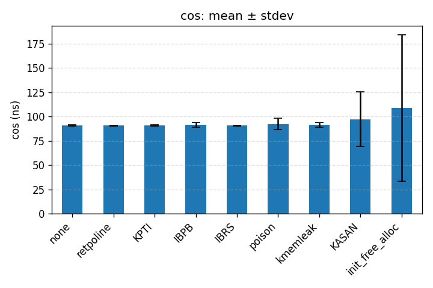
</p>

### Unstable or Inconclusive
The two IPC-based benchmarks, `pipe` and `unix_sock_stream`, both turned out highly unstable even after repeated iterations which might indicate interference from the host or other processes on the guest, or flaws in the 
benchmark code itself. These seem to show multiple test configurations outperforming the baseline, which seems 
unlikely (though we can't dismiss it entirely without more insight into the exact reasons).

<p align="center">
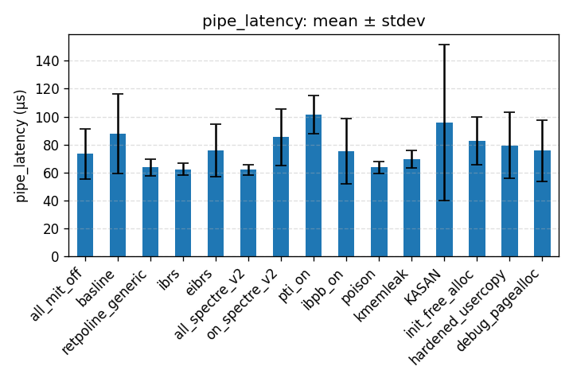
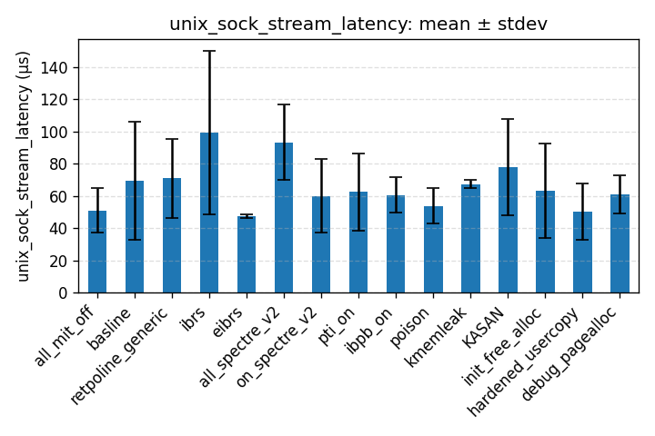
</p>

The `pipe` benchmark is slightly more stable, and shows that `pti=on` has a significant effect while `hardened_usercopy` has a slight effect. This is likely because `pipe` involves significant copying from
userspace to kernelspace, then back to userspace. This frequent copying and page transfering likely exposes 
the rare performance impact of `hardened_usercopy`.

### Real-World 

Our two real-world / macro-level benchmarks, `sqlite` and `svg_to_png` both demonstrate some of the characteristics
from the microbenchmarks (which is encouraging, indicating they are at least somewhat representative), but in general
see much less pronounced performance impact. This is likely becase a significant amount of their operation happens 
in userspace, without interacting with the kernel. This has the effect of flattening the impact of even aggressive
kernel security configurations like `KASAN` and `IBPB`.
<p align="center">

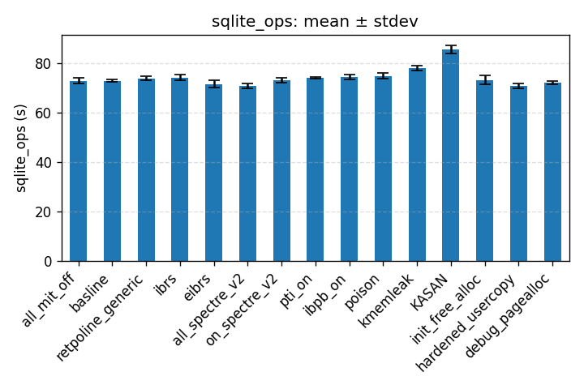

</p>
We see slightly more impact on `svg_to_png` than `sqlite`, likely because `sqlite` involves many more operations in
userspace. 

